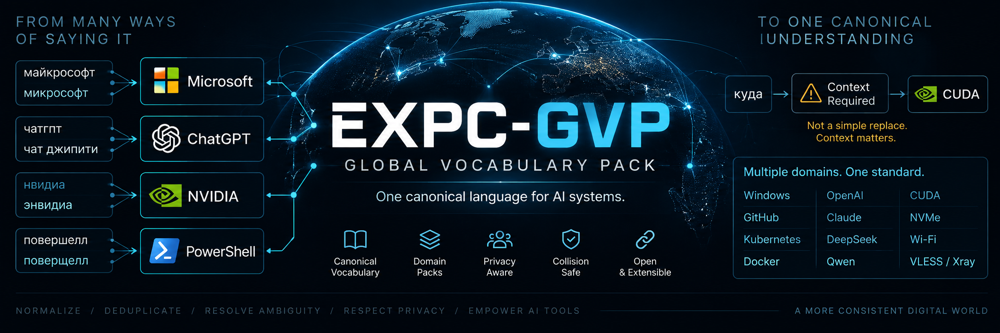

# EXPC-GVP — EXPC Global Vocabulary Pack

<p align="center">
  
</p>

## Status

**Production / Maintenance Mode.** EXPC-GVP has reached its first
production-quality Global Vocabulary Pack: **437 entities**, **267**
Russian spoken aliases, validated by a vocabulary entity schema
(`schema/gvp.schema.json`) and a Builder (`tools/builder/`, see
`docs/04_BUILDER.md`) that packages, checksums, and verifies each release
(`docs/05_DISTRIBUTION.md`, `docs/06_RELEASE_CONTRACT.md`). See
"Current release" below for the released version, and
`docs/07_MAINTENANCE.md` for how future changes are proposed and
reviewed. Still not implemented: an updater/network downloader, a GitHub
API client used by this repository itself, and any consumer integration
— this README describes what exists, not features that remain future
work.

## Current release

Current production Data Pack: **`2026.09.20.2`**

Published as a [GitHub Release](https://github.com/AlexHDman/EXPC-GVP/releases),
tagged `gvp-2026.09.20.2` per `docs/06_RELEASE_CONTRACT.md`, with three
release assets: `gvp.json`, `manifest.json`, `checksums.sha256`. Verify a
downloaded release with:

```
py -3.12 -m tools.builder verify <path-to-downloaded-release>
```

## What this is

EXPC-GVP (EXPC Global Vocabulary Pack) is a **standalone public data project**.
It is not an application and does not depend on any single consumer. Its goal
is to become a canonical, versioned vocabulary — names, terms, aliases, and
spoken forms — that other systems can consume as a shared source of truth.

## Purpose

EXPC-GVP is intended to serve as a **global canonical vocabulary**: a single
place where entity names (brands, software, AI systems, hardware, standards,
networking terms, and similar categories) are recorded once, with their
canonical original spelling, so that multiple independent consumers do not
each maintain their own divergent copy.

## Intended consumers

The vocabulary pack is designed to be consumed by, among others:

- **EXPC-WLK**
- **AI Switcher**
- **EXPC NewsBot**
- future third-party consumers not yet identified

## Canonical spelling and aliases

- The **canonical original spelling** of a term or name always has priority.
- **Aliases and spoken forms** are supported *conceptually* as part of the
  intended design — how a term is written, spoken, abbreviated, or referred
  to informally.
- Some aliases are inherently **ambiguous** (they may map to more than one
  canonical entity). Resolving these requires **context-aware logic** in
  consuming systems; EXPC-GVP does not claim to resolve ambiguity by itself.

## Layers

The vocabulary is intended to be organized in layers:

1. **Global** — universally applicable entries.
2. **Domain** — entries specific to a subject-matter domain.
3. **Organization** — entries scoped to a particular organization.
4. **Personal** — entries scoped to an individual user or context.

## Privacy boundary

EXPC-GVP is a **public** project. Only public, non-personal vocabulary data
is in scope for this repository. Personal, private, or organization-internal
data is explicitly out of scope for the public pack (see `SECURITY.md`).

## Builder (Phase 01.0-02.1)

A minimal, working Builder exists at `tools/builder/`. Run from the
repository root:

```
py -3.12 -m tools.builder build
py -3.12 -m tools.builder package --version 2026.09.20.1
py -3.12 -m tools.builder verify dist/2026.09.20.1
py -3.12 -m tools.builder release-check --tag gvp-2026.09.20.1 dist/2026.09.20.1
```

`build` loads `data/curated/*.json`, validates each entity against
`schema/gvp.schema.json`, runs semantic and collision checks, and writes a
deterministic `dist/gvp.json`. `package` wraps that same artifact into a
versioned, checksummed local Data Pack (`manifest.json` +
`checksums.sha256`), `verify` checks one standalone, and `release-check`
validates one against a `gvp-<CalVer>` Git tag — all entirely local, no
GitHub API or network access — this repository's own tooling does not
create the GitHub Release itself (`2026.09.20.2` was published manually
following this contract). See `docs/04_BUILDER.md`,
`docs/05_DISTRIBUTION.md`, and `docs/06_RELEASE_CONTRACT.md` for the full
pipeline, output format, and — importantly — what none of this does yet
(no SQLite, no updater, no network downloader, no consumer integration,
no CI).

## Distribution model

Versioned packages are distributed as:

```
local package -> GitHub Release (implemented, e.g. gvp-2026.09.20.2) -> updater -> atomic update
```

Local, versioned packaging with a manifest and SHA-256 checksums exists
(`docs/05_DISTRIBUTION.md`), and publishing that package as a GitHub
Release is now implemented as a manual, reviewed process
(`docs/06_RELEASE_CONTRACT.md`) — `2026.09.20.2` is published this way.
An updater/downloader that consumes a release automatically is **not
implemented yet**.

## Explicitly not implemented yet

The following do not exist in the repository at this stage and should not be
assumed to work:

- a SQLite (or any other) compiled data pack
- an automated/CI-driven GitHub Release publishing pipeline (publishing
  itself is implemented, but as a manual, reviewed step per
  `docs/06_RELEASE_CONTRACT.md` — not automation)
- an updater or network downloader
- GitHub Actions / CI
- consumer integration (EXPC-WLK or any other consumer)
- any Wikidata import or other bulk external dataset
- ingestion from any source other than `data/curated/*.json`

The schema, production dataset (`data/curated/`), and Builder that do
exist (`schema/`, `tools/builder/`) validate, build, and package the
current Data Pack, which is published as a GitHub Release — but an
updater, consumer integration, and CI remain future work — see
`docs/01_DATA_SCHEMA.md`, `docs/04_BUILDER.md`, `docs/05_DISTRIBUTION.md`,
`docs/06_RELEASE_CONTRACT.md`, and `SOURCES.md`.

## Related documents

- `docs/00_ARCHITECTURE.md` — conceptual pipeline and versioning model
- `docs/01_DATA_SCHEMA.md` — the entity schema, field by field
- `docs/02_VOCABULARY_LAYERS.md` — Global / Domain / Organization / Personal
- `docs/03_COLLISION_POLICY.md` — ambiguity levels and collision handling
- `docs/04_BUILDER.md` — the Phase 01.0 Builder MVP
- `docs/05_DISTRIBUTION.md` — Phase 02.0: local Data Pack packaging, manifest, checksums, verification
- `docs/06_RELEASE_CONTRACT.md` — Phase 02.1: GitHub Release tag/asset contract, local release-candidate check
- `docs/07_MAINTENANCE.md` — Production/Maintenance Mode: how future changes are proposed and reviewed
- `SOURCES.md` — source/provenance policy and current provenance state
- `THIRD_PARTY_NOTICES.md` — third-party notices (none yet)
- `CONTRIBUTING.md` — contribution flow
- `SECURITY.md` — security and privacy reporting
- `LICENSE` — licensing status and open decisions

---

# EXPC-GVP — EXPC Global Vocabulary Pack (Русский)

## Статус

**Production / Maintenance Mode.** EXPC-GVP достиг первого
production-качества Global Vocabulary Pack: **437 сущностей**, **267**
русских произносимых алиасов, валидируемых схемой словарной сущности
(`schema/gvp.schema.json`) и Builder'ом (`tools/builder/`, см.
`docs/04_BUILDER.md`), который собирает, считает контрольные суммы и
проверяет каждый релиз (`docs/05_DISTRIBUTION.md`,
`docs/06_RELEASE_CONTRACT.md`). См. «Текущий релиз» ниже и
`docs/07_MAINTENANCE.md` о том, как предлагаются и проверяются будущие
изменения. Пока не реализовано: updater/сетевой загрузчик, GitHub API
клиент внутри самого репозитория и интеграция с потребителями — этот
README описывает то, что реализовано, а не будущие планы.

## Текущий релиз

Текущий production Data Pack: **`2026.09.20.2`**

Опубликован как [GitHub Release](https://github.com/AlexHDman/EXPC-GVP/releases),
отмечен тегом `gvp-2026.09.20.2` согласно `docs/06_RELEASE_CONTRACT.md`,
с тремя ассетами релиза: `gvp.json`, `manifest.json`, `checksums.sha256`.
Проверить скачанный релиз:

```
py -3.12 -m tools.builder verify <путь-к-скачанному-релизу>
```

## Что это

EXPC-GVP (EXPC Global Vocabulary Pack) — это **самостоятельный публичный
data-проект**. Это не приложение, и он не зависит от какого-либо одного
потребителя. Цель проекта — стать каноническим, версионируемым словарём
(названия, термины, алиасы и произносимые формы), который другие системы
могут использовать как общий источник истины.

## Назначение

EXPC-GVP задуман как **глобальный канонический словарь**: единое место, где
названия сущностей (бренды, программное обеспечение, AI-системы, hardware,
стандарты, сетевые термины и подобные категории) фиксируются один раз, с их
канонической оригинальной орфографией, чтобы несколько независимых
потребителей не вели каждый свою расходящуюся копию.

## Предполагаемые потребители

Vocabulary pack предназначен, среди прочего, для:

- **EXPC-WLK**
- **AI Switcher**
- **EXPC NewsBot**
- будущих сторонних потребителей, ещё не определённых

## Каноническое написание и алиасы

- **Каноническое оригинальное написание** термина или имени всегда имеет
  приоритет.
- **Алиасы и произносимые формы** поддерживаются *концептуально* как часть
  задуманного дизайна — как термин пишется, произносится, сокращается или
  упоминается неформально.
- Некоторые алиасы по своей природе **неоднозначны** (могут соответствовать
  более чем одной канонической сущности). Разрешение такой неоднозначности
  требует **context-aware логики** в потребляющих системах; сам EXPC-GVP не
  заявляет, что разрешает неоднозначность самостоятельно.

## Слои

Словарь задуман как организованный по слоям:

1. **Global** — универсально применимые записи.
2. **Domain** — записи, специфичные для предметной области.
3. **Organization** — записи, ограниченные конкретной организацией.
4. **Personal** — записи, ограниченные конкретным пользователем или контекстом.

## Граница приватности

EXPC-GVP — **публичный** проект. В область этого репозитория входят только
публичные, неперсональные данные словаря. Личные, приватные или
внутриорганизационные данные явно исключены из публичного пакета (см.
`SECURITY.md`).

## Builder (Phase 01.0-02.1)

Минимальный рабочий Builder существует в `tools/builder/`. Запуск из
корня репозитория:

```
py -3.12 -m tools.builder build
py -3.12 -m tools.builder package --version 2026.09.20.1
py -3.12 -m tools.builder verify dist/2026.09.20.1
py -3.12 -m tools.builder release-check --tag gvp-2026.09.20.1 dist/2026.09.20.1
```

`build` загружает `data/curated/*.json`, валидирует каждую сущность
против `schema/gvp.schema.json`, выполняет semantic- и collision-проверки
и записывает детерминированный `dist/gvp.json`. `package` оборачивает
этот же артефакт в версионированный локальный Data Pack (`manifest.json`
+ `checksums.sha256`), `verify` проверяет такой пакет отдельно, а
`release-check` проверяет его против Git-тега `gvp-<CalVer>` — всё
полностью локально, без GitHub API и сети — сам инструментарий
репозитория не создаёт GitHub Release самостоятельно (`2026.09.20.2`
опубликован вручную по этому контракту). Полное описание pipeline,
формата output и — что важно — того, чего это пока НЕ делает (нет
SQLite, updater, сетевого загрузчика, интеграции с потребителями, CI) —
см. `docs/04_BUILDER.md`, `docs/05_DISTRIBUTION.md` и
`docs/06_RELEASE_CONTRACT.md`.

## Модель доставки

Версионированные пакеты распространяются по схеме:

```
локальный пакет -> GitHub Release (реализовано, напр. gvp-2026.09.20.2) -> updater -> atomic update
```

Локальная версионированная упаковка с manifest и SHA-256 контрольными
суммами реализована (`docs/05_DISTRIBUTION.md`), а публикация пакета как
GitHub Release теперь реализована как ручной, проверяемый процесс
(`docs/06_RELEASE_CONTRACT.md`) — `2026.09.20.2` опубликован именно так.
Updater/загрузчик, автоматически потребляющий релиз, **пока не
реализован**.

## Явно не реализовано на этом этапе

Следующее не существует в репозитории на данном этапе и не должно
считаться работающим:

- скомпилированный пакет данных (SQLite или любой другой)
- автоматизированный/CI-driven pipeline публикации GitHub Release
  (сама публикация реализована, но как ручной проверяемый шаг по
  `docs/06_RELEASE_CONTRACT.md` — не автоматизация)
- updater или сетевой загрузчик
- GitHub Actions / CI
- интеграция с потребителями (EXPC-WLK или любым другим)
- импорт Wikidata или любого другого массового внешнего датасета
- загрузка данных из чего-либо, кроме `data/curated/*.json`

Существующие схема, production-датасет (`data/curated/`) и Builder
(`schema/`, `tools/builder/`) валидируют, собирают и упаковывают текущий
Data Pack (`2026.09.20.2`) — но перечисленное выше (публикация через
GitHub API, updater, интеграция с потребителями, CI) по-прежнему не
реализовано — см. `docs/01_DATA_SCHEMA.md`, `docs/04_BUILDER.md`,
`docs/05_DISTRIBUTION.md`, `docs/07_MAINTENANCE.md` и `SOURCES.md`.

## Связанные документы

- `docs/00_ARCHITECTURE.md` — концептуальный pipeline и модель версионирования
- `docs/01_DATA_SCHEMA.md` — схема сущности, поле за полем
- `docs/02_VOCABULARY_LAYERS.md` — Global / Domain / Organization / Personal
- `docs/03_COLLISION_POLICY.md` — уровни неоднозначности и обработка коллизий
- `docs/04_BUILDER.md` — Phase 01.0 Builder MVP
- `docs/05_DISTRIBUTION.md` — Phase 02.0: локальная упаковка Data Pack, manifest, контрольные суммы, verification
- `docs/06_RELEASE_CONTRACT.md` — Phase 02.1: контракт тега/ассетов GitHub Release, локальная проверка кандидата релиза
- `docs/07_MAINTENANCE.md` — Production/Maintenance Mode: как предлагаются и проверяются будущие изменения
- `SOURCES.md` — политика источников/provenance и текущее состояние provenance
- `THIRD_PARTY_NOTICES.md` — уведомления о сторонних данных (пока нет)
- `CONTRIBUTING.md` — процесс участия в проекте
- `SECURITY.md` — безопасность и приватность
- `LICENSE` — статус лицензирования и открытые решения
